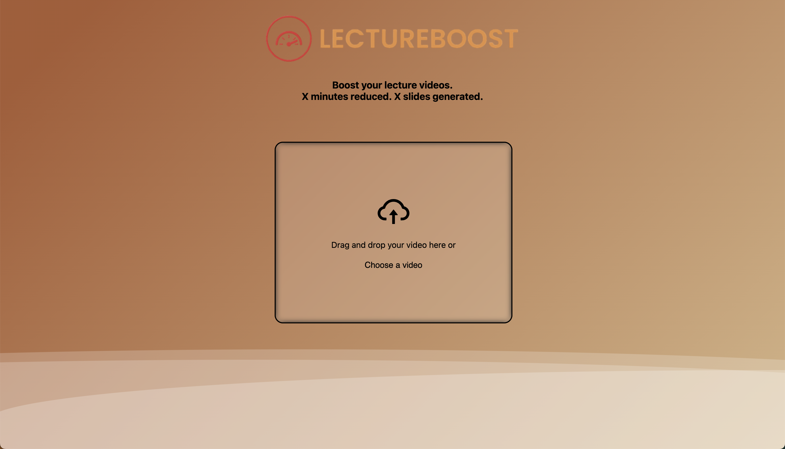
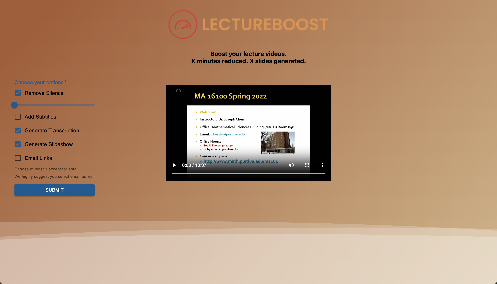
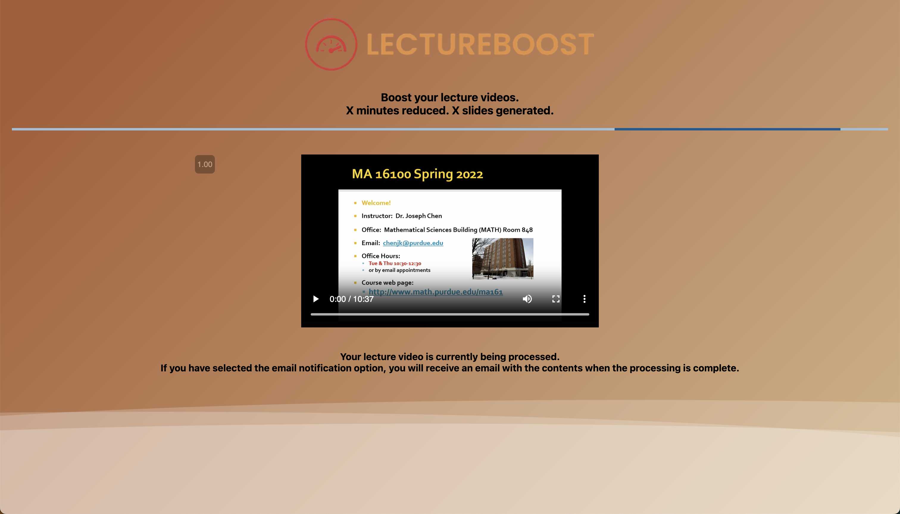

<!-- PROJECT LOGO -->
 

  

<h3 align="center">LectureBoost</h3>

<!-- TABLE OF CONTENTS -->

  
Table of Contents

  <ol>
    <li>
      <a href="#about-the-project">About The Project</a>
      <ul>
        <li><a href="#built-with">Built With</a></li>
      </ul>
    </li>
    <li><a href="#roadmap">Roadmap</a></li>
  </ol>

<!-- ABOUT THE PROJECT -->
## About The Project

The Lecture Boost project won second place in the Purdue BoilerMake 2023 hackathon competition after an initial review by contest organizers and a secondary review and vote by selected Purdue University professors. It was originally developed over a period of 36 hours by Kichul Kang (Github: kckang1103), Sam Tarr (Github: S-Tarr), and Thomas Wiegand (Github: twiegan). After the competition the code was developed further by Kichul Kang and Sam Tarr. Lecture Boost is a web application used to enhance lectures in a variety of ways:

Removing Silence:
- remove the silence in between when you lecturer starts and stops speaking
- decrease lecture times by around to 33%

Dynamic Slide Generation:
- If your slides are not available generate them just from the video
- It can even create slides from handwritten notes or whiteboard notes if your lecturer spends a lot of time writing

Transcriptions:
- Generate transcriptions of lectures with time stamps!

Subtitles:
- Add subtitles to your lecture videos

(<a href="#readme-top">back to top</a>)

### Built With

* [![React][React.js]][React-url]
* [![Flask][Flask]][Flask-url]
* [![AWS][AWS]][AWS-url]

(<a href="#readme-top">back to top</a>)

<!-- ROADMAP -->
## Roadmap

- [ ] Migrate to DigitalOcean
- [x] Add email service
- [ ] Add multiprocessing/threading to enhancement scripts
    - [x] Silence removal
    - [ ] Slide generation
    - [ ] Subtitles
    - [ ] Transcription

(<a href="#readme-top">back to top</a>)

## Gallery

(<a href="#readme-top">back to top</a>)

<!-- MARKDOWN LINKS & IMAGES -->
<!-- https://www.markdownguide.org/basic-syntax/#reference-style-links -->
[contributors-shield]: https://img.shields.io/github/contributors/github_username/repo_name.svg?style=for-the-badge
[contributors-url]: https://github.com/github_username/repo_name/graphs/contributors
[forks-shield]: https://img.shields.io/github/forks/github_username/repo_name.svg?style=for-the-badge
[forks-url]: https://github.com/github_username/repo_name/network/members
[stars-shield]: https://img.shields.io/github/stars/github_username/repo_name.svg?style=for-the-badge
[stars-url]: https://github.com/github_username/repo_name/stargazers
[issues-shield]: https://img.shields.io/github/issues/github_username/repo_name.svg?style=for-the-badge
[issues-url]: https://github.com/github_username/repo_name/issues
[license-shield]: https://img.shields.io/github/license/github_username/repo_name.svg?style=for-the-badge
[license-url]: https://github.com/github_username/repo_name/blob/master/LICENSE.txt
[linkedin-shield]: https://img.shields.io/badge/-LinkedIn-black.svg?style=for-the-badge&logo=linkedin&colorB=555
[linkedin-url]: https://linkedin.com/in/linkedin_username
[product-screenshot]: images/screenshot.png
[React.js]: https://img.shields.io/badge/React-20232A?style=for-the-badge&logo=react&logoColor=61DAFB
[React-url]: https://reactjs.org/
[Flask]: https://img.shields.io/badge/Flask-000000?style=for-the-badge&logo=flask&logoColor=white
[Flask-url]: https://flask.palletsprojects.com/en/2.2.x/
[AWS]: https://img.shields.io/badge/Amazon_AWS-232F3E?style=for-the-badge&logo=amazon-aws&logoColor=white
[AWS-url]: https://aws.amazon.com/
